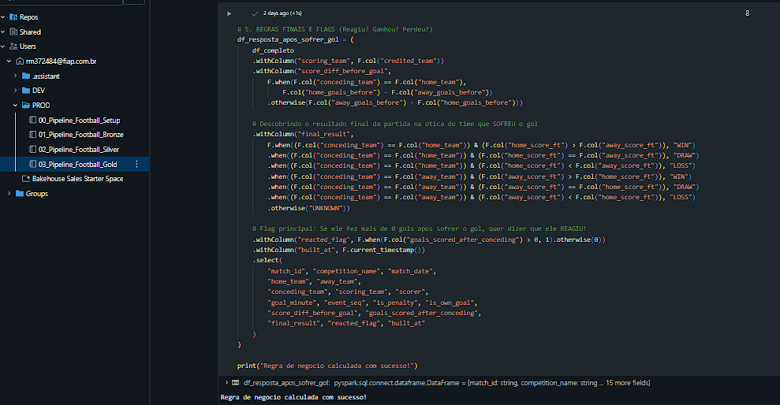
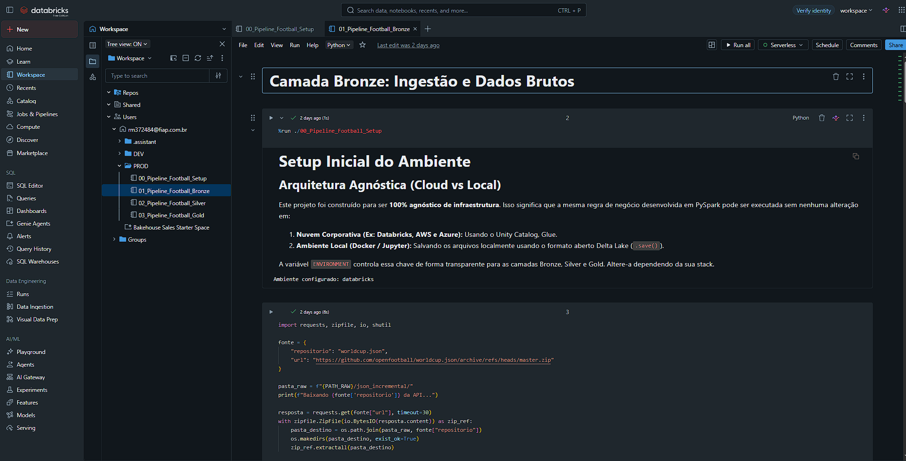
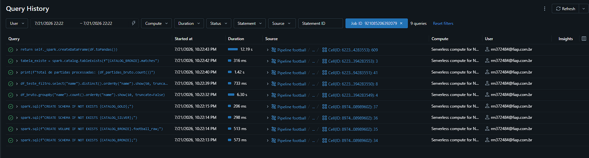

# Comparação: Databricks vs. Snowflake

**Responsável:** Guilherme Csorgo  
**Deadline:** 24/07/2025  
**Base:** pipelines descritos em [ARCHITECTURE.md](ARCHITECTURE.md), implementados em [databricks/](databricks/) e [snowflake/](snowflake/), sobre a mesma fonte (`openfootball/worldcup.json`) e a mesma regra de negócio (`FACT_REACTION_EVENTS`/`DIM_COMPETITION_SUMMARY`, agrupado por `competition_name`, `04_gold_insights.sql` no Snowflake e os notebooks/dbt no Databricks).

## 1. Facilidade de uso

| Critério | Databricks | Snowflake |
|---|---|---|
| Linguagem principal | PySpark (notebooks `.ipynb`) | SQL puro + Python auxiliar (`run_snowflake_sql.py`) |
| Curva de aprendizado | Exige conhecimento de Spark (DataFrames, joins, window functions, etc) | Exige só SQL (self-join, CTEs). Mais acessível para quem já sabe SQL |
| Interface de desenvolvimento | Notebook interativo (célula a célula, com prints/gráficos inline) | Scripts `.sql` numerados executados via CLI (`run_snowflake_sql.py`) ou Snowsight |
| Orquestração das camadas | Execução sequencial dos 4 notebooks | Procedures encadeadas + Tasks (`06_pipeline_procedures_and_schedule.sql`) |
| Time to market** | ~2 semanas (business hours) | ~2 semanas (business hours) |

> ** Segundo a análise do grupo, os dois pipelines levaram aproximadamente o mesmo tempo (~2 semanas) para ficar prontos. O tempo de desenvolvimento não leva em consideração a expertise de cada usuário nas plataformas, então essa paridade não deve ser lida como "as duas plataformas são igualmente fáceis". É só o dado bruto de tempo gasto.

### Evidências
As evidencias completas estão disponiveis na pasta dos respectivos pipelines, dentro de `evidencias`. 

#### Databricks

#### Snowflake

---

## 2. Ingestão / transformação

| Critério | Databricks | Snowflake |
|---|---|---|
| Ingestão Bronze | PySpark lê JSON direto, grava em Delta (`MERGE` incremental) | Python baixa/achata em CSV local, `COPY INTO` via stage interno |
| Formato de armazenamento | Delta Lake (ACID, time travel nativo) | Tabelas nativas Snowflake (ACID nativo, sem versionamento de arquivo explícito no pipeline) |
| Camada Silver | PySpark: tipagem, quarentena por regras de qualidade | SQL: tipagem (`TRY_TO_...`), quarentena pelas mesmas regras (minuto 0–130, placar não negativo) |
| Camada Gold | PySpark + SQL, self-join temporal para `reacted_flag` | SQL puro, mesma lógica de self-join (dbt models idênticos aos do Databricks) |
| Evolução de schema | Unity Catalog | Schema Evolution nativo do Snowflake |

**Observação:** a lógica de negócio da camada Gold é **literalmente igual** nos dois projetos dbt (`databricks/dbt_openfootball/` e `snowflake/dbt_openfootball/`), então a diferença aqui é puramente de engine/sintaxe, não de resultado.

**Volume real processado (Databricks, evidência em `databricks/evidencias/`):**

| Tabela | Linhas |
|---|---|
| `bronze.matches` (partidas) | 1.067 |
| `bronze.goals_raw` (gols brutos) | 1.195 |
| `silver.goal_events` (gols limpos) | 1.195 |
| `silver.goal_events_quarantine` (rejeitados) | 0 |
| `gold.fact_reaction_events` | 1.195 |

Confirma a estimativa de ~1.000 partidas da seção 3 (era 1.067 na prática) e mostra **0 registros em quarentena** — ou seja, para essa fonte (`worldcup.json`), as regras de Data Quality não rejeitaram nenhum evento de gol.

**PENDENTE (Membro 3):** mesma contagem de linhas por camada no Snowflake, para confirmar que os dois pipelines processam exatamente o mesmo volume (esperado, já que a fonte e o filtro são idênticos).

### Evidencias
As evidencias completas estão disponiveis na pasta dos respectivos pipelines, dentro de `evidencias`. 

#### Databricks

#### Snowflake

---

## 3. Performance

| Critério | Databricks | Snowflake |
|---|---|---|
| Modelo de computação | **Serverless Compute**, elástico, provisionado sob demanda só durante a execução do notebook | Warehouse `WH_DI_P_PIPELINE`, tamanho `XSMALL`, auto-suspend em 60s |
| Adequação ao volume do projeto | "Overkill" para o volume atual:  todas as Copas do Mundo (1930–2026) somam **1.067 partidas reais** , não dezenas de milhares. Spark compensa em volumes bem maiores que isso | Mais que suficiente para o volume atual; warehouse `XSMALL` já sobra espaço de processamento |
| Tempo de execução Medallion | Bronze 1m 9s + Silver 38s + Gold 32s = **2m 22s** no total | **PENDENTE (Membro 3):** mesma medição no histórico de queries/tasks do Snowflake |
| Custo de "cold start" | Nenhum cold start manual a gerenciar: Serverless Compute já inclui o provisionamento elástico dentro do tempo medido acima (não existe cluster para ligar antes de rodar) | Warehouse `XSMALL` sobe em segundos, cobrado a partir do primeiro segundo de uso |

### Evidencias
As evidencias completas estão disponiveis na pasta dos respectivos pipelines, dentro de `evidencias`. 

#### Databricks

#### Snowflake

### Projeção de escala (minutos → horas por semana)

O volume atual do projeto é pequeno. O pipeline do Databricks roda em **2m 22s por semana**; O Snowflake, ainda sem medição, estimado na mesma ordem de grandeza. Para embasar a discussão de "o que acontece se o projeto crescer", projetamos um cenário hipotético de algumas horas de processamento por semana (ex.: ingestão diária durante mês de Copa, enriquecimento com mais ligas/temporadas, ou granularidade maior de eventos):

| Cenário | Databricks | Snowflake |
|---|---|---|
| Atual (~2m22s por semana) | Serverless Compute provisiona e processa nesses 2m22s, sem cluster para gerenciar; nenhum "pedágio" de boot separado do tempo medido | Warehouse `XSMALL` sobe em segundos, processa, auto-suspende em 60s. Praticamente todo o tempo cobrado é processamento de fato |
| Projetado (algumas horas/semana) | Serverless escala elasticamente com a carga. O tempo tende a crescer de forma mais linear com o volume, sem degrau de redimensionamento manual | Rodando o mesmo warehouse `XSMALL` por horas, o tempo escala de forma linear; se o volume exigir mais velocidade, o warehouse precisa ser redimensionado manualmente (ver custo mais pra baixo) |

**Leitura:** Databricks Serverless escala automaticamente sem intervenção, enquanto o Snowflake exige redimensionar o warehouse manualmente (`XSMALL`→`SMALL`→...) se a velocidade não for suficiente. Isso é operacionalmente mais simples no Databricks, mas o Snowflake dá controle mais previsível de custo por não escalar sozinho.

---

## 4. Governança

| Critério | Databricks | Snowflake |
|---|---|---|
| Catálogo/organização | Unity Catalog (`workspace.bronze/silver/gold`) | Banco `DI_P_MEDALLION` com schemas `BRONZE/SILVER/GOLD/QC/PIPE` |
| Linhagem (lineage) | Unity Catalog rastreia automaticamente | Rastreada manualmente via `SOURCE_FILE`, `_RUN_ID`, `QC.PIPELINE_RUNS` |
| Controle de acesso | Unity Catalog RBAC | RBAC nativo do Snowflake (roles/grants). Não implementado explicitamente nos scripts do trabalho |
| Qualidade de dados | Quarentena em tabelas Delta separadas | Quarentena em tabelas + `QC.CHECK_RESULTS`/`QC.PIPELINE_RUNS` + testes dbt |
| Dados sensíveis | N/A (base pública, sem PII) | N/A (base pública, sem PII) |

### Frequência de atualização

**Semanal (toda segunda, 06h)** na "temporada" (ago–mai); **mensal (dia 1, 06h)**, só verificação, no recesso (jun–jul); correções sob demanda. Cadência implementada em `06_pipeline_procedures_and_schedule.sql` (`PIPE.TASK_WORLDCUP_WEEKLY`) e documentada em `ARCHITECTURE.md`.

### Retenção (hot/cold por camada)

Política geral: **manter tudo**, já que o custo de storage é baixo (base cabe em dezenas de MB) e não há obrigação legal de expurgo (sem dado pessoal). Diferença é só hot vs. cold storage por idade:

| Camada | O que guardar | Retenção | Depois disso |
|---|---|---|---|
| Bronze | Arquivos brutos (JSON/TXT) | Indefinido | Cold storage após 24 meses sem acesso |
| Silver | Dado limpo consolidado | Indefinido | — |
| Silver | Versões intermediárias de migração de schema | 90 dias | Descarte |
| Gold | Versão atual das métricas | Indefinido | — |
| Gold | Versões históricas (modelos anteriores) | 12 meses | Cold storage |

Isso é relevante para a seção de custo: como a política é "manter tudo" e o volume é pequeno, o custo de storage tende a zero nas duas plataformas. A variável de custo real do projeto é compute (DBU/crédito), não armazenamento.

### Dados sensíveis (Ausencia de PII)

Mesmo sem dado sensível na base escolhida, definimos uma abordagem caso houvesse: tokenização/mascaramento antes da persistência (mapeamento em cofre externo tipo AWS Secrets Manager/Vault), anonimização irreversível na Silver, e RBAC por perfil (engenheiro de dados = acesso total; analista/cientista de dados = leitura restrita/anonimizada; consumidor de dashboard = só Gold). As duas plataformas têm suporte nativo equivalente:

| Mecanismo | Databricks | Snowflake |
|---|---|---|
| Mascaramento dinâmico | Unity Catalog Column Masks | Dynamic Data Masking Policies |
| Auditoria de acesso | Unity Catalog (log nativo) | Access History |

Isso confirma o que já estava na tabela acima (a não implementação do RBAC). Isso é uma decisão de design documentada, não há implementação disso em código rodando.

---

## 5. Custo

### Modelo de cobrança

**Databricks: DBU (Databricks Unit):**
- Cobrança por DBU consumida × preço por DBU (varia por tipo de compute e tier).
- O pipeline deste projeto roda em **Serverless Compute**, não em cluster clássico. No compute clássico, o DBU não inclui a VM (paga-se DBU + infraestrutura cloud separadamente); no Serverless, a Databricks roda o compute na própria conta cloud dela e cobra tudo embutido no preço do DBU. Não existe fatura separada de VM/EC2 para o time de sustentação gerenciar.
- Referência de mercado (2026, valores públicos de list price. Preços variam bastante entre fontes, trataremos apenas como referencia):  
  * Jobs Compute clássico ≈ US$ 0,15–0,30/DBU;  
  * SQL/Data Warehousing ≈ US$ 0,22/DBU;  
  * Interactive/All-Purpose (notebook manual) ≈ US$ 0,40/DBU;  
  * Serverless (Jobs/SQL) tende a cobrar um pouco mais por DBU que o Jobs Compute clássico, mas em troca já embute o custo de infraestrutura. Não há uma tabela pública única e confiável para o rate exato de Serverless Jobs, então tratamos isso como faixa, não número fechado.
- Tier Standard está sendo descontinuado em 2026 (planos migrando para Premium). Premium custa ~30-37% a mais que os valores de Standard citados acima.

**Snowflake: crédito de warehouse + storage:**
- Cobrança por **crédito** consumido pelo warehouse (1 crédito/hora para `XSMALL`), dobra a cada tamanho:
  * Small: 2 
  * Medium: 4 
  * Large: 8 
  * Armazenamento (~US$ 23/TB/mês, cobrado separado do compute).
- Preço do crédito por edição (2026, list price): Standard ≈ US$ 2/crédito, Enterprise ≈ US$ 3, Business Critical ≈ US$ 4.
- Warehouse do projeto: `XSMALL`, `AUTO_SUSPEND = 60` (economiza créditos entre execuções, já que o pipeline roda 1x/semana).

> Números de mercado levantados via pesquisa pública (usamos free tier das plataformas). Ver PENDENTE abaixo para substituir por valores medidos.

### Estimativa para o cenário do grupo

O volume atual do projeto, considerando o tempo real do Databricks (**2m 22s/semana**, medido) e Snowflake ainda estimado, e uma projeção de crescimento (algumas horas de processamento por semana, como por exemplo, se o pipeline passasse a rodar diariamente em mês de Copa com mais ligas/temporadas). Warehouse/compute mantidos no menor nível (`XSMALL` / Serverless mínimo) nos dois cenários, sem redimensionamento.

| Item | Databricks (Serverless) | Snowflake (`XSMALL`) |
|---|---|---|
| Frequência de execução | Semanal (± diária em mês de Copa) | Semanal (± diária em mês de Copa) |
| Tempo por execução **atual** | **Real: 2m 22s** (job de 21/07/2026) | **PENDENTE (Membro 3):** estimado na mesma ordem de grandeza (poucos minutos) |
| Custo por execução **atual** | (~US$ 0,02–0,10 aplicando as faixas de DBU acima sobre 2m22s). **falta o valor real de DBU consumido**, só temos o tempo | ≈ US$ 0,10–0,30 (fração de 1 crédito sobre poucos minutos) |
| Custo mensal **atual** (fora de Copa) | < US$ 1/mês (estimado) | ≈ US$ 1–3/mês (estimado) |
| Tempo por execução **projetado** (algumas horas/semana) | ~3h/semana (hipótese de trabalho) | ~3h/semana (hipótese de trabalho) |
| Custo por execução **projetado** | ≈ US$ 0,45–1,20/semana (faixa Serverless/Jobs sobre 3h) | ≈ US$ 6–12/semana (3 créditos × US$2–4) |
| Custo mensal **projetado** (×4,33 semanas) | ≈ US$ 2–5/mês | ≈ US$ 26–52/mês |

**Leitura da projeção:** no volume atual (minutos por semana), o custo absoluto é irrelevante nas duas plataformas: menos de um dólar por mês. Extrapolando para horas/semana, a diferença fica mais visível: como o Databricks deste projeto já roda em Serverless, a faixa de DBU aplicável é a mais barata disponível, então mesmo na projeção de horas/semana, o Databricks tende a sair mais barato que manter um warehouse Snowflake ligado pelo mesmo tempo, porque mesmo a faixa alta de DBU Serverless/Jobs (~US$0,40) ainda é menor que 1 crédito Snowflake (~US$2-4) por hora equivalente de trabalho pequeno.

> **Ressalva importante:** essa comparação usa preços de mercado (list price) sobre o **tempo real** do Databricks, mas não sobre o **custo real faturado**. Ainda não temos o print de DBU consumido/fatura de nenhuma das duas plataformas. Os valores aqui continuam sendo estimativa, só que agora ancorada num tempo medido de verdade (Databricks) em vez de um chute de "poucos minutos".

> **Observação:** no Snowflake a variável principal de escalabilidade é o tamanho do warehouse, que escala em degraus (dobrando a cada tier), diferente do Databricks Serverless, que escala de forma mais contínua/automática.

> **Observação 2:** Consultar `ARCHITECTURE.md` para detalhes da frequência de execução.

---

## 6. Conclusão

**Ainda não é a versão final**. Falta a evidência real do Snowflake (tempo de execução, volume por camada, custo/DBU ou consumo de crédito). O que segue é o que já dá para afirmar com confiança hoje, e o que continua sendo suposição até essa evidência chegar.

### O que já podemos concluir

- **Volume do projeto é beem pequeno:** 1.067 partidas, 1.195 eventos de gol, 0 em quarentena, não dezenas de milhares imaginavamos que haveria.
- **O pipeline roda rápido nas condições atuais:** o Databricks mediu 2m22s para as três camadas (Bronze→Silver→Gold) via Serverless Compute, sem cluster para gerenciar. Não há motivo para achar que o Snowflake (mesmo volume, warehouse `XSMALL`) seria significativamente mais lento — mas isso ainda precisa ser medido, não assumido.
- **A regra de negócio é idêntica e já produz resultado de verdade nas duas plataformas** (dbt compartilhado, mesmo `FACT_REACTION_EVENTS`/`DIM_COMPETITION_SUMMARY`), o que valida a comparação: não estamos comparando "maçã com laranja".

### O que ainda é estimativa (pendente de evidência do Snowflake)

- **Custo real de qualquer uma das duas plataformas.** Temos preço de mercado (list price) e, do lado Databricks, um tempo real medido. mas nenhuma fatura/consumo de DBU ou crédito real de nenhuma das duas. A tabela da seção 5 é a melhor estimativa possível hoje, não um número fechado.
- **Tempo de execução do Snowflake.** Sem isso, não dá para afirmar qual plataforma é mais rápida na prática — só que, no papel, as duas deveriam ser rápidas para esse volume.

### Rascunho de recomendação (a confirmar quando a evidência do Snowflake chegar)

Com o que temos até agora, a leitura é: para o **volume atual do projeto** (~1.000 partidas, atualização semanal/mensal), as duas plataformas são tecnicamente capazes e baratas — a decisão pende mais para **facilidade operacional** do que para performance ou custo bruto:

- **Snowflake** exige só SQL (curva de aprendizado menor para quem não sabe Spark) e não tem infraestrutura para gerenciar (warehouse é só um parâmetro).
- **Databricks**, rodando em Serverless (não cluster clássico), também remove a complexidade operacional que normalmente pesaria contra ele — o que enfraquece o argumento clássico "Databricks é mais complexo de operar" para este projeto específico.
- Nenhuma das duas se justifica pelo volume de dados sozinho: ~1.000 partidas é pequeno demais para forçar a mão para qualquer lado nesse critério.

**A palavra final deste documento fica condicionada à evidência do Snowflake.** Se o tempo/custo real do Snowflake vier na mesma ordem de grandeza do Databricks (o esperado, dado o volume), a conclusão provavelmente vai pesar mais para critérios qualitativos (facilidade de uso, governança, lock-in) do que para custo/performance — mas isso só pode ser afirmado com confiança depois que os dois lados tiverem evidência real, não só um.
